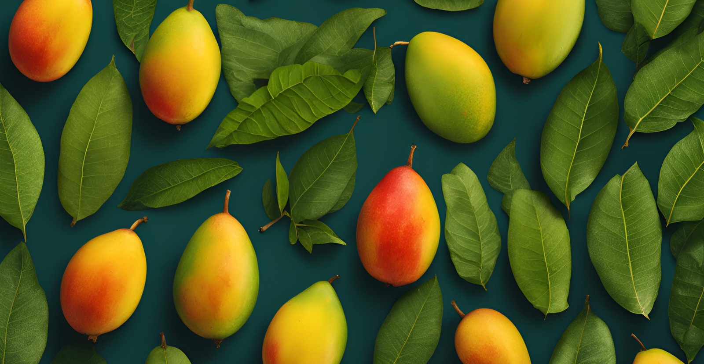

# Mango Leaf Health Classifier: A Deep Learning Web Application with CI/CD Pipeline and Deployment on Azure App Services

This project is an end-to-end deep learning web application designed to classify mango leaves as either healthy or diseased. It leverages a Convolutional Neural Network (CNN) model built using transfer learning with the VGG16 architecture pre-trained on the ImageNet dataset. The model is fine-tuned with a custom dataset of mango leaf images, enabling accurate disease detection.

The application includes a fully integrated pipeline for data ingestion, model development, training, evaluation, and prediction. It uses tools like TensorFlow, Keras, DVC, MLflow, and Dagshub for version control, experiment tracking, and model management. The web service is developed using Flask, and the project employs continuous integration and deployment (CI/CD) workflows with GitHub Actions, Azure Container Registry (ACR), and Azure App Service for seamless updates and scalable deployment.

---
## Table of Contents
- [Project Overview](#project-overview)
- [Key Features](#key-features)
- [Project Architecture](#project-architecture)
- [Tools and Technologies](#tools-and-technologies)
- [Installation and Setup](#installation-and-setup)
- [License](#license)
- [Contributors](#contributors)

## Project Overview
This project is an end-to-end deep learning web application designed to classify mango leaves as either healthy or diseased. It leverages a Convolutional Neural Network (CNN) model built using transfer learning with the VGG16 architecture pre-trained on the ImageNet dataset. The model is fine-tuned with a custom dataset of mango leaf images, enabling accurate disease detection.

The project includes a fully integrated pipeline for data ingestion, model development, training, evaluation, and prediction, utilizing tools like TensorFlow, Keras, DVC, MLflow, and Dagshub for version control, experiment tracking, and model management. The application is deployed as a web service using Flask, with continuous integration and deployment (CI/CD) workflows managed through GitHub Actions, Azure Container Registry (ACR), and Azure App Service, ensuring seamless updates and scalable deployment for real-time mango leaf disease classification.

This application has a wide range of use cases, including aiding farmers and agricultural experts in early detection of mango leaf diseases to prevent crop loss and optimize yield. It supports plant pathologists in identifying disease patterns and developing treatment plans, while also serving as a practical tool for teaching machine learning and plant disease diagnosis.

---

## Key Features
- **Transfer Learning**: Uses the pre-trained VGG16 model fine-tuned with mango leaf images.
- **Integrated Pipeline**: Manages data ingestion, model training, evaluation, and prediction with DVC.
- **Experiment Tracking**: Tracks model metrics and experiments using MLflow and Dagshub.
- **CI/CD Deployment**: Ensures seamless updates with GitHub Actions, Azure App Service, and Azure Container Registry.
- **Web App**: Provides an intuitive interface for users to upload images and receive classification results in real time.

---

## Project Architecture
1. **Data Ingestion**:
   - Dataset fetched from an S3 bucket.
   - Preprocessing and augmentation performed to prepare the data for training.

2. **Model Development**:
   - VGG16 model updated by replacing the top layers with a flatten layer and a dense softmax layer.
   - Trained using TensorFlow and Keras.

3. **Pipeline Stages**:
   - DVC used to define stages for data ingestion, model training, and evaluation.

4. **Experiment Tracking**:
   - MLflow and Dagshub integrated for logging experiments and managing models.

5. **Web App Deployment**:
   - Flask web application for real-time image classification.
   - CI/CD pipeline with GitHub Actions for building and deploying Docker images to Azure App Service.

---

## Tools and Technologies
- **Programming Language**: Python
- **Deep Learning Frameworks**: TensorFlow, Keras
- **Pipeline Management**: DVC
- **Experiment Tracking**: MLflow, Dagshub
- **Web Framework**: Flask
- **Cloud Storage**: S3
- **CI/CD**: GitHub Actions, Azure App Service, Azure Container Registry (ACR)
- **Containerization**: Docker
- **Version Control**: Git

---

## Installation and Setup
1. Clone the repository:
   ```bash
   git clone https://github.com/OlumideOlumayegun/leaf-disease-classification-on-azure-app-service.git
   cd leaf-disease-classification-on-azure-app-service
   ```

2. Create a virtual environment and activate it:
   ```bash
   python3 -m venv venv
   source venv/bin/activate  # On Windows: venv\Scripts\activate
   ```

3. Install dependencies:
   ```bash
   pip install -r requirements.txt
   ```

4. Run the Flask application locally:
   ```bash
   python app.py
   ```

5. Access the web app in your browser at `http://127.0.0.1:8080/`.

---

## License
This project is licensed under the MIT License. See the [LICENSE](LICENSE) file for details.

---

## Contributors
- **Olumide Olumayegun** - [GitHub](https://github.com/OlumideOlumayegun)